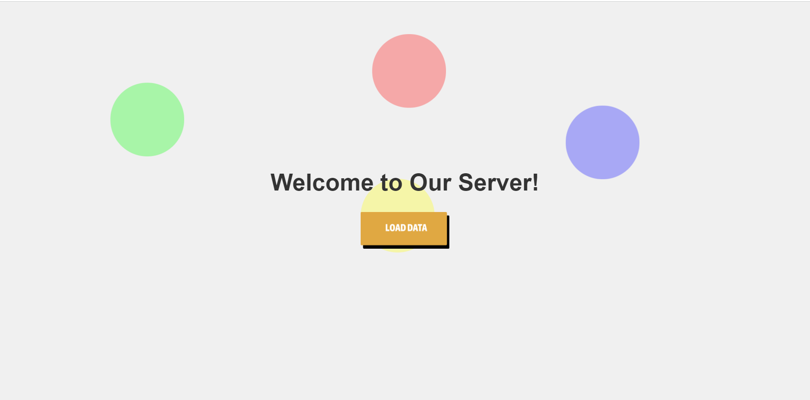
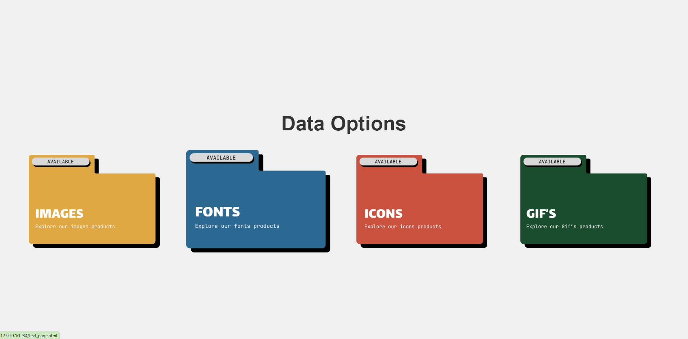

# Making a Web Server using Socket Programming with Python





## Group Members
| NIM        | Name                                | Tasks                                   |
| --------   | ---------------------------         |-----------------------------------------|
| 1301225492 | Romario Viegas Francisco Marcal     |   
| 1301224458 | Ari Ramadhan                        | 
| 1301224458 | Laode Muhammad                      | 

## About this project
- Demonstrate the Web server using Socket Programming. By making the simple server that can load some several data like images, fonts, gifs and icons. 
- GUI display implemented using html, css and some js logix script.

## Features

The features below are 100% done and implemented.
- Single-Thread request.
- Multi-Thread request.
- Running and open the server through browser and terminal.
- Handle the status for response.

## Requirements
- Latest `Python 3` version
- fundamental knowledge of Web Server using Socket Programming.
- With some basic Html, and css.

## Setup
Make sure all requirements are installed in your local machine beforehand. Then, clone this repository.
```bash
git clone https://github.com/Mr-Roma/Final-Project-Socket-Programming.git
```

## Program Structure

```
│ README.md
│ .gitignore
│
└─── assets
      ├─ fonts
      │    ├─ arial-font.png
      │    ├─ courier.png
      │    ├─ georgia.png
      │    ├─ times_new_roman.jpg
      │    ├─ verdana.jpg
      ├─ gifs
      │    ├─ gif_2.gif
      │    ├─ gif_3.gif
      │    ├─ gif_4.gif
      ├─ images
      |    ├─ gif_1.gif
      |    ├─ image_1.jpeg
      |    ├─ image_2.jpeg
      |    ├─ image_3.jpeg
      |    ├─ image_4.jpeg
      ├─ interface
      |    ├─ home_1.png
      |    ├─ home_2.png
      └─ widgets
      |    ├─ fonts.png
      |    ├─ gif.png
      |    ├─ icons.png
      |    ├─ images.png
      |    ├─ load_data.png
| client.py
| gif_page.html
| image_page.html
| index.html
| newpage.html
| print.py
| README.md
| server.py
| server2.py
| text_page.html
```